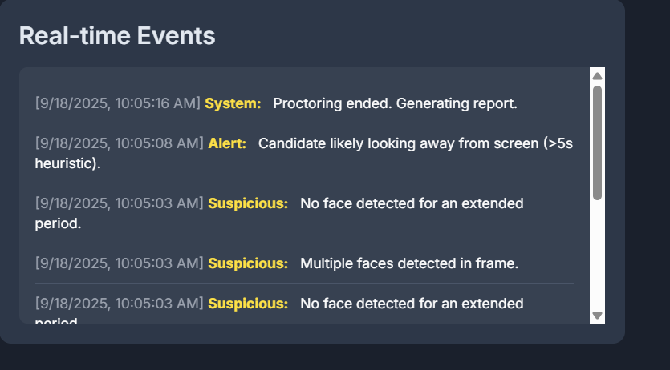
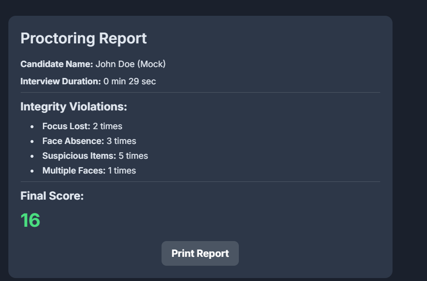

# 🎥 Focus & Object Detection in Video Interviews

A lightweight **AI-powered video proctoring system** built with **TensorFlow.js, BlazeFace, and COCO-SSD**.  
It helps interviewers monitor candidates in real-time during online interviews by detecting focus and unauthorized objects.

---

## ✨ Features
- 📹 **Webcam Capture & Recording** – Candidate’s video is streamed and analyzed in real time.  
- 👤 **Face Detection (BlazeFace)**  
  - Detects if candidate looks away for >5s.  
  - Flags absence of face (>10s).  
  - Detects multiple faces in frame.  
- 📱 **Object Detection (COCO-SSD)**  
  - Identifies mobile phones, books, laptops, and notes.  
  - Logs suspicious items with timestamps.  
- ⚠️ **Real-time Alerts & Logs** – Event feed with audio alerts for suspicious activity.  
- 📑 **Proctoring Report**  
  - Candidate name & duration  
  - Focus lost count  
  - Suspicious events  
  - Final integrity score (100 – deductions)  
- 🎁 **Bonus**  
  - Optional audio alerts (Tone.js).  
  - Simple UI with TailwindCSS.  

---

## 🛠️ Tech Stack
- **Frontend**: HTML, TailwindCSS, Vanilla JS  
- **AI Models**:  
  - [BlazeFace](https://github.com/tensorflow/tfjs-models/tree/master/blazeface) (face detection)  
  - [COCO-SSD](https://github.com/tensorflow/tfjs-models/tree/master/coco-ssd) (object detection)  
- **Libraries**: TensorFlow.js, Tone.js  

---

## 📂 Project Structure
```
.
├── proctoring.html   # Main app file (single-page)
└── README.md         # Documentation
```

---

## 🚀 Getting Started

### 1. Clone the repo
```bash
git clone https://github.com/Ayushy21/Focus-Object-Detection-in-Video-Interviews/edit/main/README.md
cd proctoring-system
```

### 2. Open in VS Code
- Install the **Live Server** extension (by Ritwick Dey).
- Right-click `proctoring.html` → **Open with Live Server**.


### 3. Allow Camera Access
- When prompted, click **Allow Camera**.
- You should now see your webcam feed with live detection.

---

## 📝 Usage
- **Start Proctoring** → Begins detection and logging events.  
- **End Interview & Report** → Stops detection and generates final integrity report.  
- **Print Report** → Export the report as PDF.  

---

## 📊 Scoring Logic
- Looking away (>5s): **-2 points**  
- No face (>10s): **-5 points**  
- Suspicious items: **-10 points each**  
- Multiple faces: **-15 points each**  
- Final score = `100 - deductions` (min 0).  

---


## 📸 Screenshots





---

